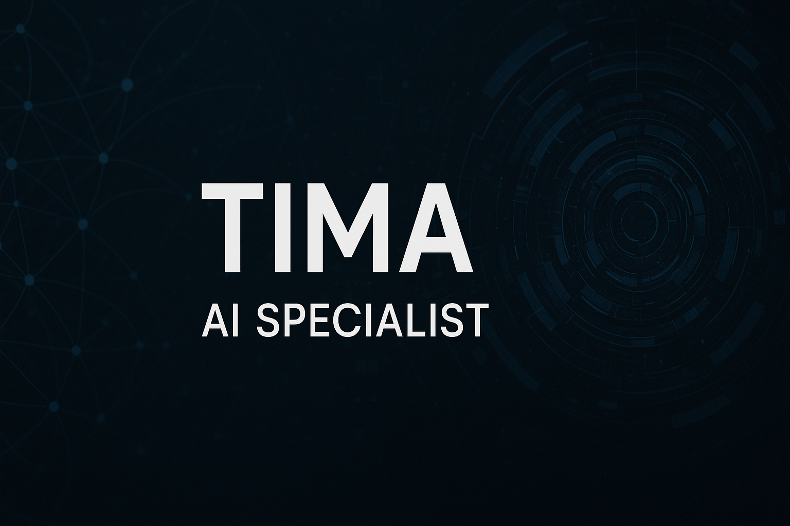

<h1 align="center">Hello, I'm Tima 👋</h1>
<h3 align="center">AI Specialist • Data Analysis • Flutter Developer</h3>
<h2 align="center">Creative Technologist | Problem Solver</h2>

  

  

 
💡 I am a dedicated **AI Specialist** and **Front-Stack Developer** with a passion for building innovative systems that bridge the gap between cutting-edge technology and real-world solutions. My work spans deep learning models, mobile applications, and immersive 3D visual simulations, always with a focus on creating impactful outcomes.

- 🎓 **BSc in Information Technology**, AI Specialization – *Damascus University* (2021–present)
- 🔭 **Currently working on:** Advanced AI simulations, NLP pipelines, real-time web/mobile applications, and 3D visual computing
- 🌱 **Learning more about:** Generative AI, LangChain, and advanced visual intelligence techniques
- 🧠 **Driven by:** Empowering individuals and organizations with AI solutions that drive meaningful change
- 🌍 **Languages:** Arabic 🇸🇾 | English 🌍
- 📫 **Contact me:** [tima302t@gmail.com](mailto:tima302t@gmail.com)

---

### 🚀 Tech Stack

#### 💻 Programming Languages

#### 📊 AI/ML Libraries

#### 🎨 Frontend, Visualization & Frameworks

#### 🛠️ Tools & Platforms

---

### 📂 Notable Projects

#### 💡 AI & ML
- 🧠 [RecoMindSystem](https://github.com/Tima-Dawwa/RecoMindSystem) – AI-powered recommendation system for personalized suggestions.  
- 🩺 [Dermatology-Smart-Expert-System](https://github.com/Tima-Dawwa/Dermatology-Smart-Expert-System) – Python-based expert system for assisting in dermatology diagnosis.  
- 📘 [Alrifai_Training-Task](https://github.com/Tima-Dawwa/Alrifai_Training-Task) – Training notebooks covering ML and AI fundamentals.  
- 📰 [Subjectivity-in-News-Articles](https://github.com/Tima-Dawwa/Subjectivity-in-News-Articles) – LSTM model to detect subjectivity and bias in news reporting.  
- 🚢 [Titanic - Machine Learning from Disaster](https://github.com/Tima-Dawwa/Titanic---Machine-Learning-from-Disaster) – Classical ML project predicting Titanic survival.  
- 🌐 [NLP with Disaster Tweets](https://github.com/Tima-Dawwa/Natural-Language-Processing-with-Disaster-Tweets) – NLP classifier to detect disaster-related tweets.  

#### 📱 Mobile & Web
- 📊 [Medist-Dashboard](https://github.com/Tima-Dawwa/Medist-Dashboard) – Admin panel for managing medical supplies and inventory.  
- 🏥 [Medist-Application](https://github.com/Tima-Dawwa/Medist-Mobile) – Flutter app for medical supply tracking with cross-platform support.  
- ✈️ [Travel App - Mobile](https://github.com/Tima-Dawwa/Travel-App-Mobile) – Flutter travel app with Firebase Auth, chat, and push notifications.  
- 🌍 [Travel App - Web](https://github.com/Tima-Dawwa/Travel-App-Web) – React-based web app for travel management.  
- 🖼️ [Smart-Gallery](https://github.com/Tima-Dawwa/Smart-Gallery) – Flutter gallery app with AI-based image organization.  
- 💻 [Tima-Dawwa](https://github.com/Tima-Dawwa/Tima-Dawwa) – Personal portfolio and profile repository.  

#### ⚙️ Systems & Java Projects
- 💊 [Drug-Distribution-Mpi](https://github.com/Tima-Dawwa/Drug-Distribution-Mpi) – C# system for simulating distributed drug logistics using MPI.  
- 📦 [RAR](https://github.com/Tima-Dawwa/RAR) – C# utility for handling file compression and extraction.  
- 🖥️ [Compiler-Project](https://github.com/Tima-Dawwa/Compiler-Project) – Java-based compiler implementation for educational purposes.  
- 🎮 [min-max-4Wins](https://github.com/Tima-Dawwa/min-max-4Wins) – Java game using Min-Max AI algorithm for 4-in-a-row.  
- 🎲 [ZeroSquaresGame](https://github.com/Tima-Dawwa/ZeroSquaresGame) – Puzzle/strategy Java game with advanced state-based mechanics.  

---

### 🎓 Volunteer Experience
- 👩‍🏫 **Lecture Writer – RBCs**: Simplified technical content for student use.  
- 💉 **AI Developer – MedLife Athar**: Built tools for medical prediction, annotation, and evaluation.  

---

### 📊 GitHub Stats

  
  
  
  
  

---

### 🌐 Connect with Me

  
  
  

---

> “Always building. Always learning. Always pushing boundaries.”
