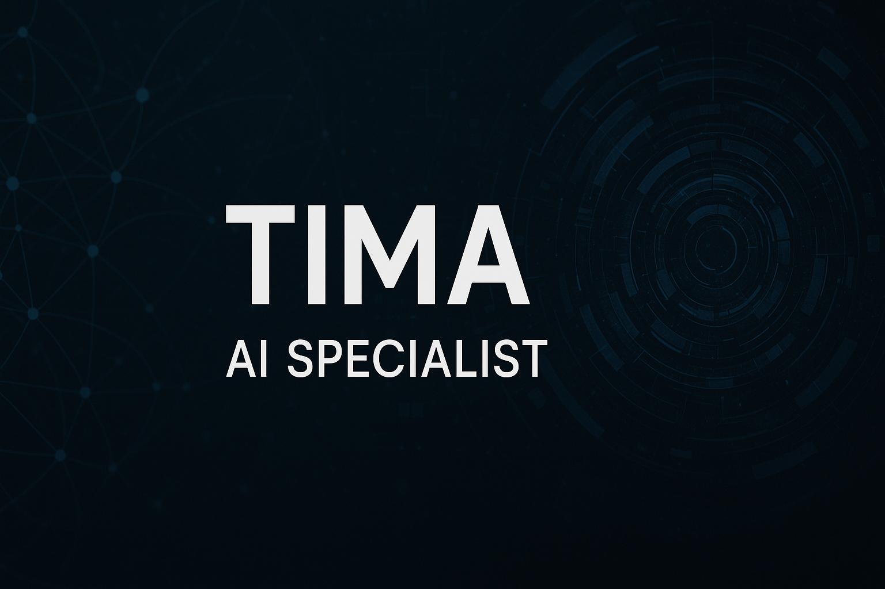

<h1 align="center">Hello, I'm Tima 👋</h1>
<h3 align="center">AI Specialist • Flutter Developer</h3>
<h2 align="center">Creative Technologist | Problem Solver</h2>

  

  

 
💡 I am a dedicated **AI Specialist** and **Full-Stack Developer** with a passion for building innovative systems that bridge the gap between cutting-edge technology and real-world solutions. My work spans deep learning models, mobile applications, and immersive 3D visual simulations, always with a focus on creating impactful outcomes.

- 🎓 **BSc in Information Technology**, AI Specialization – *Damascus University* (2021–present)
- 🔭 **Currently working on:** Advanced AI simulations, NLP pipelines, real-time web/mobile applications, and 3D visual computing
- 🌱 **Learning more about:** Generative AI, LangChain, and advanced visual intelligence techniques
- 🧠 **Driven by:** Empowering individuals and organizations with AI solutions that drive meaningful change
- 🌍 **Languages:** Arabic 🇸🇾 | English 🌍
- 📫 **Contact me:** [tima302t@gmail.com](mailto:tima302t@gmail.com)

### 🚀 Tech Stack

#### 💻 Programming Languages

#### 📊 AI/ML Libraries

#### 🎨 Frontend, Visualization & Frameworks

---

### 📂 Notable Projects

#### 💡 AI & ML
- 🧠 [Subjectivity-in-News-Articles](https://github.com/tima-dawwa/Subjectivity-in-News-Articles): LSTM model to detect news bias.
- 🌐 [NLP with Disaster Tweets](https://github.com/tima-dawwa/Natural-Language-Processing-with-Disaster-Tweets): Tweet relevance classifier.
- 🚢 [Titanic ML](https://github.com/tima-dawwa/Titanic---Machine-Learning-from-Disaster): Survival prediction with classical ML.

#### 📱 Mobile & Web
- ✈️ [Travel App - Mobile](https://github.com/tima-dawwa/Travel-App-Mobile): Flutter app with Firebase Auth, WebSocket chat, and push notifications.
- 🌍 [Travel App - Web](https://github.com/tima-dawwa/Travel-App-Web): Interactive frontend with React.
- 🏥 [Medist App](https://github.com/tima-dawwa/Medist-Mobile): Cross-platform app for medical supply tracking.
- 📊 [Medist Dashboard](https://github.com/tima-dawwa/Medist-Dashboard): Admin panel for inventory control.

---

### 🎓 Volunteer Experience
- 👩‍🏫 **Lecture Writer – RBCs**: Simplified technical content for student use.
- 💉 **AI Developer – MedLife Athar**: Built tools for medical prediction, annotation, and evaluation.

---

### 📊 GitHub Stats

---

### 🌐 Connect with Me

---

> “Always building. Always learning. Always pushing boundaries.”
